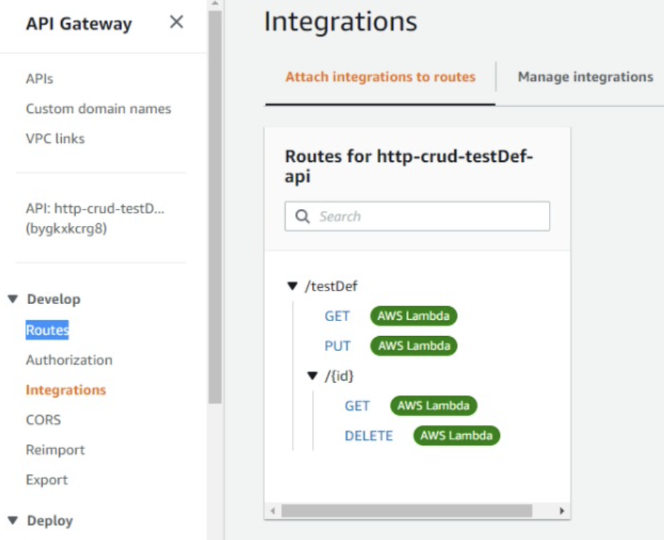

<h1> PokDex</h1>

<h2>Aplicação</h2>

Essa aplicação faz a automação do processo de correção de testes, possibilitando que provas objetivas sejam corrigidas de forma rápida, segura e escalável, além disso possibilita ao professor uma visão dos principais indicadores sobre os testes cadastrados, tais como:

Por turma:
Quantidade de alunos x Quantidade de provas realizadas
Média de acertos
Histórico de provas realizadas

Por aluno:
Histórico de provas realizadas em todas as turmas
Histórico de notas

Temos no backlog o desenvolvimento da integração da nossa solução à Alexa, com isso poderemos promover a acessibilidade de pessoas com deficiência visual

<h2>Utilizados</h2>
<ul>
<li>Alexa</li>
<li>AWS DynamoDB</li>
<li>AWS Functions Lambda</li>
<li>AWS API HTTP</li>
<li>AWS API Gateway</li>
</ul>

<h2>Documentação das APIs</h2>
<ul>
<li>https://pokdex1.docs.apiary.io/#</li>
</ul>

<h2>Documentação das APIs</h2>
<ul>
<li>https://bygkxkcrg8.execute-api.sa-east-1.amazonaws.com/testDef</li>
<li>https://75ruc54rpk.execute-api.sa-east-1.amazonaws.com/testInst</li>
<li>https://8ohpl05svh.execute-api.sa-east-1.amazonaws.com/notaTurma</li>
<li>https://ci5lnwmm57.execute-api.sa-east-1.amazonaws.com/notaAluno</li>
</ul>

<h2>Passo a passo para criar o projeto na AWS</h2>

<li>Criar tabela no banco de dados DynamoDB</li>

- [ ] Abra o console do DynamoDB em https://console.aws.amazon.com/dynamodb/
- [ ] Escolha Create table
- [ ] Em Table name (Nome da tabela), insira http-crud-testDef-items
- [ ] Em Primary key (Chave primária) insira id
- [ ] Escolha Create (Criar)

Repita esse processo para gerar uma tabela com o nome http-crud-testInst-items

<li>Criar uma função lambda</li>

- [ ] Abra o console do Lambda em https://console.aws.amazon.com/lambda
- [ ] Escolha Create function (Criar função).
- [ ] Em Function name (Nome da função), insira http-crud-testDef-function.
- [ ] Em Permissions (Permissões), escolha Change default execution role (Alterar a função de execução padrão).
- [ ] Selecione Create a new role from AWS policy templates (Criar uma nova função a partir de modelos de política da AWS).
- [ ] Em Role name (Nome da função), insira http-crud-testDef-role.
- [ ] Em Policy templates (Modelos de políticas), escolha Simple microservice permissions. Esta política concede à função do Lambda permissão para interagir com o DynamoDB.
- [ ] Escolha Create function (Criar função).
- [ ] Abra index.js no editor de código do console e substitua seu conteúdo pelo código a seguir. Escolha Deploy (Implantar) para atualizar a sua função.

Repita esse processo para gerar uma tabela com o nome http-crud-testInst-items

```
const AWS = require("aws-sdk");

const dynamo = new AWS.DynamoDB.DocumentClient();

exports.handler = async (event, context) => {
  let body;
  let statusCode = 200;
  const headers = {
    "Content-Type": "application/json"
  };

  try {
    switch (event.routeKey) {
      case "DELETE /items/{id}":
        await dynamo
          .delete({
            TableName: "testDef",
            Key: {
              id: event.pathParameters.id
            }
          })
          .promise();
        body = `Deleted item ${event.pathParameters.id}`;
        break;
      case "GET /items/{id}":
        body = await dynamo
          .get({
            TableName: "testDef",
            Key: {
              id: event.pathParameters.id
            }
          })
          .promise();
        break;
      case "GET /items":
        body = await dynamo.scan({ TableName: "testDef" }).promise();
        break;
      case "PUT /items":
        let requestJSON = JSON.parse(event.body);
        await dynamo
          .put({
            TableName: "testDef",
            Item: {
              id: requestJSON.id,
              price: requestJSON.price,
              name: requestJSON.name
            }
          })
          .promise();
        body = `Put item ${requestJSON.id}`;
        break;
      default:
        throw new Error(`Unsupported route: "${event.routeKey}"`);
    }
  } catch (err) {
    statusCode = 400;
    body = err.message;
  } finally {
    body = JSON.stringify(body);
  }

  return {
    statusCode,
    body,
    headers
  };
};
```

<li>Crie uma API HTTP</li>

- [ ] Inicie uma sessão no console do API Gateway em https://console.aws.amazon.com/apigateway
- [ ] Escolha Create API (Criar API) e, em seguida, em API HTTP (API HTTP), escolha Build (Criar)
- [ ] Em API name (Nome da API), insira http-crud-testDef-api
- [ ] Escolha Next (Próximo)
- [ ] Em Configure routes (Configurar rotas), escolha Next (Próximo) para ignorar a criação da rota. Você cria rotas mais tarde
- [ ] Analise o estágio que o API Gateway cria para você e escolha Next (Avançar)
- [ ] Escolha Create (Criar)

Repita esse processo para http-crud-testInst

<li>Crie rotas</li>

- [ ] Inicie uma sessão no console do API Gateway em https://console.aws.amazon.com/apigateway.
- [ ] Selecione a API.
- [ ] Selecione Routes (Rotas).
- [ ] Escolha Create (Criar).
- [ ] Em Método, escolha GET.
- [ ] Para o caminho, insira /items/{id}. O {id} no final do caminho é um parâmetro de caminho que o API Gateway recupera do caminho de solicitação quando um cliente faz uma solicitação.
- [ ] Escolha Create (Criar).
- [ ] Repita as etapas quatro a sete para GET /items; DELETE /items/{id} e PUT /items.

Após finalizar, repita esse processo para http-crud-testInst

<li>Crie uma integração</li>

- [ ] Inicie uma sessão no console do API Gateway em https://console.aws.amazon.com/apigateway.
- [ ] Selecione a API.
- [ ] Escolha Integrations (Integrações).
- [ ] Escolha Manage integrations (Gerenciar integrações) e, em seguida, escolha Create (Criar).
- [ ] Pule Attach this integration to a route (Anexar esta integração a uma rota). Você conclui isso em uma etapa posterior.
- [ ] Em Integration type (Tipo de integração), escolha Lambda function (Função do Lambda).
- [ ] Em Lambda function (Função do Lambda), insira http-crud-testDef-function.
- [ ] Escolha Create (Criar).

Após finalizar, repita esse processo para http-crud-testInst

<li>Anexe a sua integração às rotas</li>

- [ ] Inicie uma sessão no console do API Gateway em https://console.aws.amazon.com/apigateway.
- [ ] Selecione a API.
- [ ] Escolha Integrations (Integrações).
- [ ] Escolha uma rota.
- [ ] Em Choose an existing integration (Escolher uma integração existente), escolha http-crud-testDef-function.
- [ ] Escolha Attach integration (Anexar integração).
- [ ] Repita as etapas quatro a seis para todas as rotas.

Todas as rotas mostram que há uma integração com o AWS Lambda anexada.



Após finalizar, repita esse processo para http-crud-testInst
